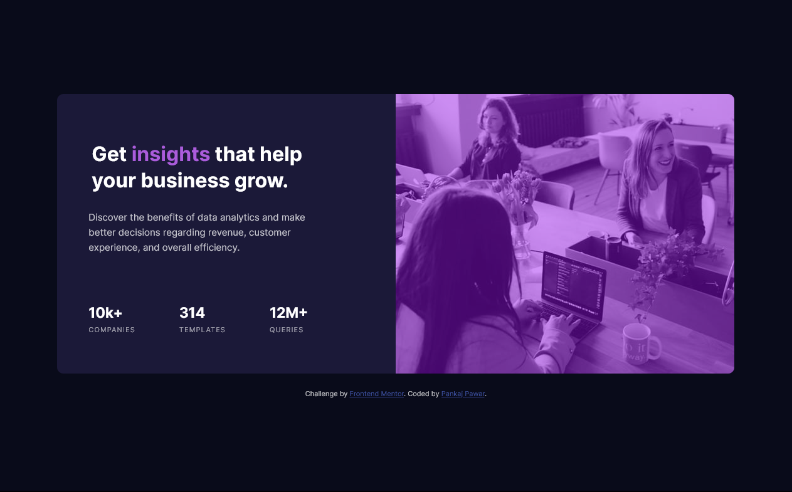

# Frontend Mentor - Stats preview card component solution

This is a solution to the [Stats preview card component challenge on Frontend Mentor](https://www.frontendmentor.io/challenges/stats-preview-card-component-8JqbgoU62). Frontend Mentor challenges help you improve your coding skills by building realistic projects. 

## Table of contents

- [Overview](#overview)
  - [The challenge](#the-challenge)
  - [Screenshot](#screenshot)
  - [Links](#links)
- [My process](#my-process)
  - [Built with](#built-with)
  - [What I learned](#what-i-learned)
  - [Continued development](#continued-development)
  - [Useful resources](#useful-resources)
- [Author](#author)
- [Acknowledgments](#acknowledgments)


## Overview

### The challenge

Users should be able to:

- View the optimal layout depending on their device's screen size

### Screenshot




### Links

- Solution URL: [https://github.com/DamnItAzriel/stats-preview-card-component]
- Live Site URL: [https://stats-preview-card-component-lake-delta.vercel.app/]

## My process
- HTML
  - Created Mobile Webpage First
    - Image at top (srcset to integrate different images depending on the width of the browser)
    - Heading
    - Paragraph
    - Stats in seperate div
  - Desktop
    - Image floated to right
    - Heading
    - Paragraph
  - Stats in flex

- CSS
  - Mobile
    - Margin 75px auto
    - Text align center
    - Color (Background, Body, Text)
    - Appropriate padding & margins
    - Rounded corner
      - Div Containing card should be given border radius
        - For top give border radius to image and containing div
        - For bottom give border radius to bottom last div for div containg card
        - bottom radius: top-left top-right bottom-right bottom-left;
    - Coloring Image
      - Make a filter for the color you want to be given to image(online available)
      - Reduce opacity of image
  - Desktop
    - Appropriate width to image and div card
    - Float image to right
    - Increase font-size for heading
    - Border radius adjusted as per desktop from mobile
    - Text align changed
    - Flex added to stats with appropriate margin

### Built with

- Semantic HTML5 markup
- CSS custom properties
- Flexbox

### What I learned

Used border radius to give rounded corners.

Learnt to use flex. It is easy and fast.
```css
/*Used flex for the 2nd time. It is smooth*/
#col {
        display: flex;
        padding-top: 30px;
    }
div#card{
        /*width: 50%;
        ....
        ....
        padding-left: 50px;*/
        border-radius: 10px 0px 0px 10px;
        /* Border radius:top-left top-right bottom-right bottom-left;*/
    }
```
### Continued development
- In mobile webpage development for image, I struggled fair bit between the div and image as the div always had 3px margin at bottom relative to image bottom. Would love to see if I can make it better. Issue resolved by making div height same as image height.
- Used a website to make filter to create image color shown in webpage. The color provided here looked a bit light hence I took a dark shade of the same color. Aded opacity to achive the overlay effect. Will look if this can be achieved using different method.

### Useful resources

- [https://www.w3schools.com/css/tryit.asp?filename=trycss3_flexbox]- Flexbox example.
- [https://dev.to/ellen_dev/two-ways-to-achieve-an-image-colour-overlay-with-css-eio]- Article regarding image colour overlay with css.

## Author

- Website - [Pankaj Pawar](https://twitter.com/DamnItAzriel)
- Frontend Mentor - [@DamnItAzriel](https://www.frontendmentor.io/profile/DamnItAzriel)
- Twitter - [@DamnItAzriel](https://twitter.com/DamnItAzriel)

## Acknowledgments

I would like to thank frontend mentor for creating such amazing projects which help beginners like me practice.
